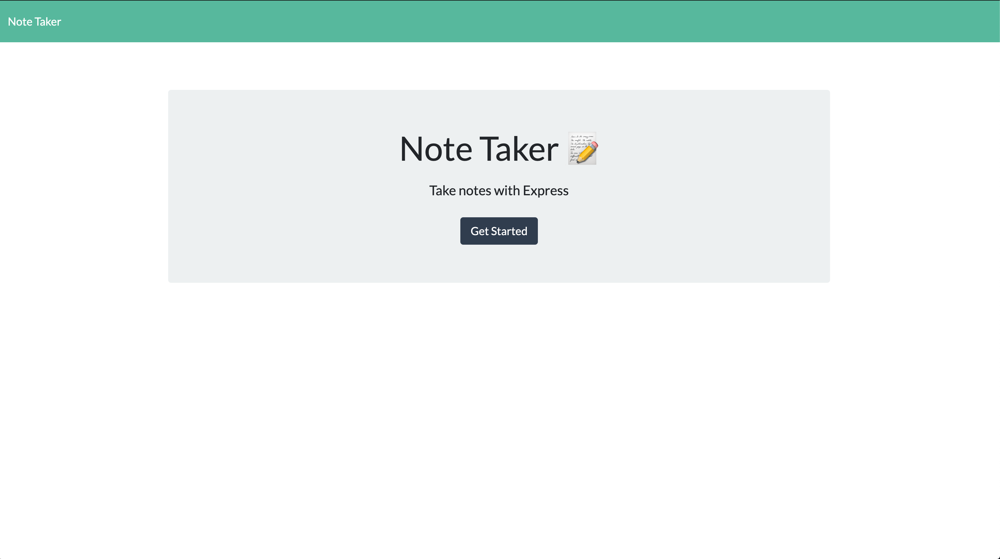
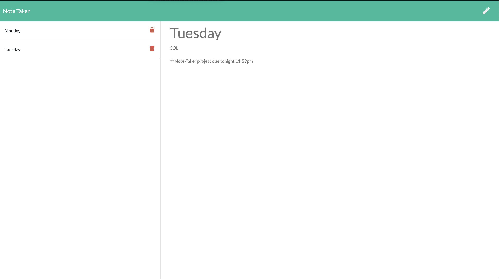

# Note-taker

  ## Description
  This app was created to take quick notes and have access to it anywhere. 

  ---
## Preview: 

---
  ## Table of Contents
* [Installation](#installation)
* [Usage](#usage)
* [License](#license)
* [Contributions](#contributions)
* [Tests](#tests)
* [Questions](#questions)

---
## Installation
Bring this repo to local machine. Run on Visual Studio Code and open a terminal. Once terminal is open, you will need to first run "node install" in the terminal. Once that is installed, run "npm start". You will be able to test it on your local machine by going to the browser and going to http://localhost:8080/ to test local or visit the live site :  https://notetaker-sp.herokuapp.com/ 

---
## Usage
Make daily notes. 

---
## License

Copyright 2021
Permission is hereby granted, free of charge, to any person obtaining a copy of this software and associated documentation files (the "Software"), to deal in the Software without restriction, including without limitation the rights to use, copy, modify, merge, publish, distribute, sublicense, and/or sell copies of the Software, and to permit persons to whom the Software is furnished to do so, subject to the following conditions:
The above copyright notice and this permission notice shall be included in all copies or substantial portions of the Software.
THE SOFTWARE IS PROVIDED "AS IS", WITHOUT WARRANTY OF ANY KIND, EXPRESS OR IMPLIED, INCLUDING BUT NOT LIMITED TO THE WARRANTIES OF MERCHANTABILITY, FITNESS FOR A PARTICULAR PURPOSE AND NONINFRINGEMENT. IN NO EVENT SHALL THE AUTHORS OR COPYRIGHT HOLDERS BE LIABLE FOR ANY CLAIM, DAMAGES OR OTHER LIABILITY, WHETHER IN AN ACTION OF CONTRACT, TORT OR OTHERWISE, ARISING FROM, OUT OF OR IN CONNECTION WITH THE SOFTWARE OR THE USE OR OTHER DEALINGS IN THE SOFTWARE.

---
## Contributions
Special thanks to Georgia Tech Boot-camp staff for the positive feedback and support. 
I would like to thank my classmates for assisting me whenever I reach out to them on slack. 

---

## Badges

---

## Tests
On Website: https://notetaker-sp.herokuapp.com/ 

---

## GitHub
[Note-taker](https://github.com/Spatel134/note-taker.git)! 

 *Please use Google Chrome browser*